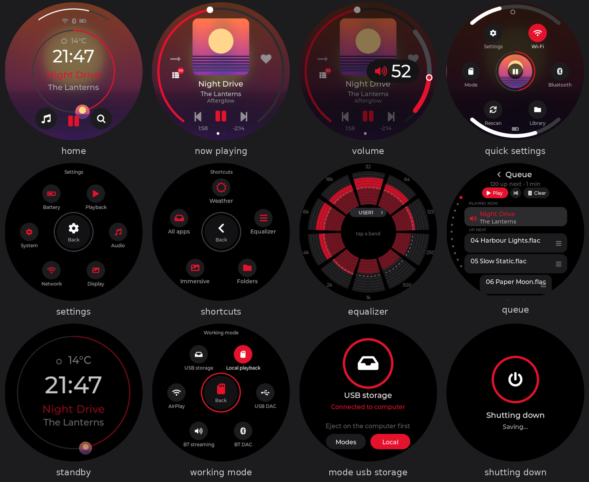
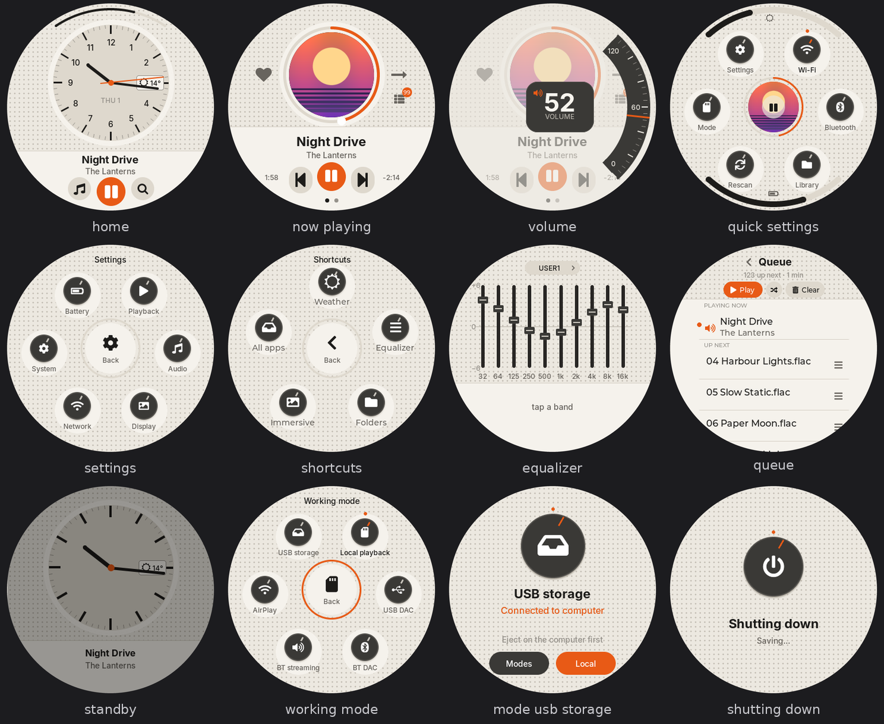

# diskOS — reworked UI (fork)

> **Thank you, [b0hemia](https://github.com/b0hemia)!** This work stands entirely on
> [diskOS](https://github.com/b0hemia/diskos): the custom firmware, installer and original UI that made any of
> this possible. All credit for diskOS itself goes to b0hemia and the diskOS contributors; this fork only
> reworks the on-device interface.

> **Disclaimer:** this software is provided **as is**, for **testing and experimentation only**, without warranty
> of any kind, express or implied. Installing custom firmware or UI software can misbehave, lose data or make a
> device temporarily unusable. **You use it entirely at your own risk**; the author of this fork accepts no
> responsibility or liability for any damage, data loss or other consequences arising from its use. This fork is
> not affiliated with or endorsed by FiiO or the upstream diskOS project. (See also the warranty disclaimer in
> the GPL, `ui/COPYING`.)

This fork of [b0hemia/diskos](https://github.com/b0hemia/diskos) by [zmd22](https://github.com/zmd22) replaces the
on-device UI (`ui/`, the `mq_ui` binary) of the **FiiO Snowsky Disc** with an interface designed for its round
360×360 screen. The installer is unchanged. Two complete looks ship in one build — **Ring** and **Braun** —
switchable in **Settings › Display › Theme**.

* **Based on:** diskOS **1.1.2**, firmware **V2.40**. Upstream 1.1.3's changes are not included.
* **Every feature, with screenshots:** [docs/fork/FEATURES.md](docs/fork/FEATURES.md)
* **Detailed change log:** [docs/fork/CHANGES.md](docs/fork/CHANGES.md)

| Ring | Braun |
|---|---|
|  |  |

---

## Design philosophy

**Made for a circle.** The Disc's screen is round, so the interface is too, instead of a phone layout with its
corners cut off. Progress is a ring, volume and brightness are arcs on the rim, menus are buttons orbiting a hub,
and the most important control always sits where a thumb lands.

**Ring — the default.** Black, so the edge of the panel disappears and only the content glows. Colour comes from
the music: the accent can follow the album, and media screens take on the cover's colour. Lists curve with the
circle.

**Braun — a second voice.** A 70s Braun / Dieter Rams look built on *less, but better*: warm off-white, a
speaker-grille texture, dark knobs with a pointer and an indicator lamp, straight lists on a solid lower panel, and
one orange accent that only ever means *on, primary or focused*. It favours legibility over decoration.

**Shared rules.** Big touch targets for one hand; everything reachable by a tap (gestures are shortcuts, never the
only way); nothing that blocks the music (heavy work runs off the UI thread, lists only build the rows you can see,
Bluetooth and Wi-Fi commands have time limits); and honest feedback (a toast says what was *requested* when the
player can't confirm it was done).

## Gestures worth knowing

Most things are a tap. These are the ones that aren't obvious:

| Where | Gesture | What it does |
|---|---|---|
| Anywhere | Pull down from the **top edge** | Quick Settings (swipe up to close) |
| Anywhere | Swipe right from the **left edge** | Back (steps up inside the Library first) |
| Anywhere but Home / Now Playing | Long swipe up from the **bottom edge** | Home |
| Any back arrow or menu hub | **Hold** | Straight to Home, from any depth |
| Home | Swipe left | Shortcuts (your five, set in Settings › Display › Shortcuts) |
| Now Playing | Long straight swipe left / right | Options menu / back |
| Now Playing (Ring) | Drag around the ring | Seek |
| Now Playing | Tap the cover / tap the title | Immersive view with lyrics / the album, current song highlighted |
| Volume popup | Drag along the right rim; tap the middle | Set the level; close |
| Library | Hold a song / hold an album | Song menu (add to queue, playlist, favourite…) / play the album |
| Album wall | Hold the centre cover | Play the whole album |
| Folders | Hold a file or folder | Rename, copy / move, delete, add to queue, tags |
| Queue | Hold a row's handle and drag | Reorder |
| Equalizer | Tap a band, drag in / out; double-tap; tap the value | Select and set; reset the band; number pad |
| Search | Hold Backspace | Clear the query |
| Weather | Tap / hold the place name | Type a city / back to automatic |
| Power key | Hold 5 s | Shuts down (with a "Shutting down" screen) |

## Install

Download `mq_ui` from this repository's **Releases** (check its md5 against the release notes).

**Permanent:** install it with the regular diskOS installer:

```bash
./diskos-installer install --firmware SNOWSKY_DISC_update_V2.40.zip --ui /path/to/mq_ui
```

**Quick try without reflashing** (diskOS already installed, SSH enabled; reverts at the next reflash):

```sh
ssh root@<ip> 'cat > /usr/data/mq_ui.new && chmod 755 /usr/data/mq_ui.new && md5sum /usr/data/mq_ui.new' < mq_ui
ssh root@<ip> 'mv /usr/data/mq_ui.new /usr/data/mq_ui; killall -9 mq_ui; setsid /usr/data/mq_ui </dev/null >/dev/null 2>&1 &'
```

## Build

Same as upstream: `cd ui && make CROSS=mipsel-linux-musl-` with the mipsel musl cross toolchain
([musl.cc](https://musl.cc)). The release also carries `diskos-ui-fork-vs-upstream.patch`: apply it to a clean
checkout of b0hemia/diskos at `v1.1.2` and build — it reproduces the released `mq_ui` byte for byte.

## Licence

The UI keeps diskOS's licensing (GPL-3.0-or-later for `ui/`, see `ui/COPYING`); new files carry SPDX headers.
Bundled fonts keep their own licences: Inter (Braun theme) is under the SIL Open Font License 1.1, see `ui/OFL-Inter.txt`; Montserrat and the Font Awesome symbols come with LVGL.
