# diskOS UI fork — features

> **Thank you, [b0hemia](https://github.com/b0hemia)!** This work stands entirely on
> [diskOS](https://github.com/b0hemia/diskos) — the custom firmware, installer and original UI that made any of
> this possible. All credit for diskOS itself goes to b0hemia and the diskOS contributors; this fork only
> reworks the on-device interface.

> **Disclaimer:** this software is provided **as is**, for **testing and experimentation only**, without warranty
> of any kind, express or implied. Installing custom firmware or UI software can misbehave, lose data or make a
> device temporarily unusable. **You use it entirely at your own risk**; the author of this fork accepts no
> responsibility or liability for any damage, data loss or other consequences arising from its use. This fork is
> not affiliated with or endorsed by FiiO or the upstream diskOS project. (See also the warranty disclaimer in
> the GPL, `ui/COPYING`.)

A reworked touch interface for the **FiiO Snowsky Disc** (round 360×360 screen), built on the diskOS
UI as released in **diskOS 1.1.2** (the `ui/` folder is identical in 1.1.0–1.1.2). Everything below is in
`ui/`; the installer and the rest of diskOS are unchanged.

The design language: **rings and orbits** made for a round screen — progress rings, rim arcs, menus whose
buttons orbit a hub, lists whose rows curve with the circle — with the album's colour as the accent.

---

## Home
The clock inside the playing track's progress ring, the cover riding the ring at the current position,
the weather above the clock, title (album colour) and artist below, and Library · play/pause · Search.
The battery is an arc on the top rim (red when low).

| Playing | Low battery | Idle |
|---|---|---|
| 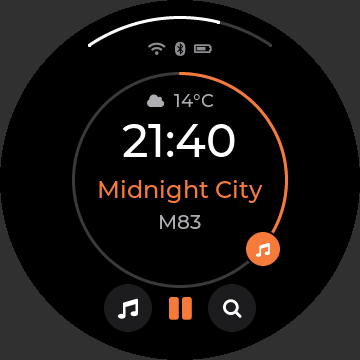 | 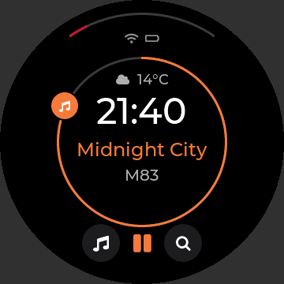 | 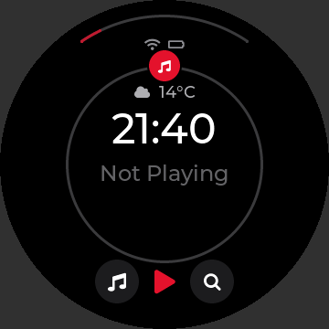 |

## Standby screen
The **Ring** screensaver: a bigger, dimmed version of Home — weather on top, a large clock, title and
artist — inside a faint progress ring with the cover on it. Redraws once a minute. The original styles
(Cover, Analog, Minimal, Digital, Vinyl) remain selectable.

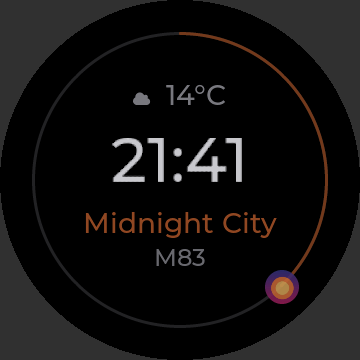

## Now Playing
Four styles: **Ring** (the cover in its progress ring, drag the ring to seek), **Poster**, Cover and
Vinyl. Long titles scroll briefly, then settle. A queue icon with a count sits under the play-mode icon.
The **immersive** view (tap the cover) shows the cover and synced lyrics.

| Ring | Ring, long title | Poster | Immersive + lyrics |
|---|---|---|---|
| 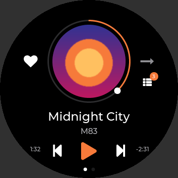 | 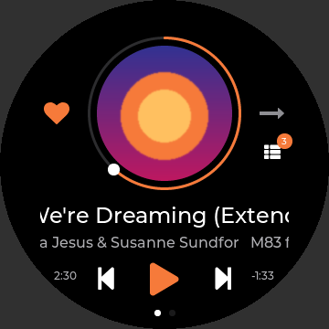 | 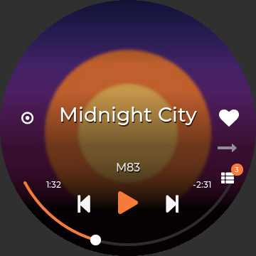 | 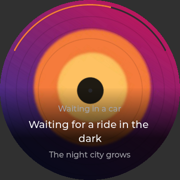 |

**Volume popup:** an arc on the right rim in the accent colour, value at clock size; drag the arc, tap the
middle to close.  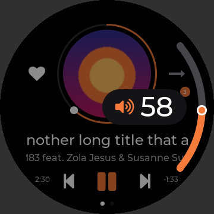

**Options menu** (swipe left on Now Playing, or the ⋯ button): eight actions orbiting the cover —
Favourite, Playlist, Lyrics, Equalizer, Info, Album, Artist, Tags.  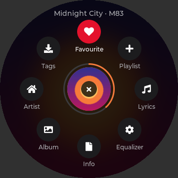

## Orbit menus
Quick Settings, Settings and Working mode as orbits around a hub (tap the hub to go back).

| Quick Settings | Settings | Working mode |
|---|---|---|
| 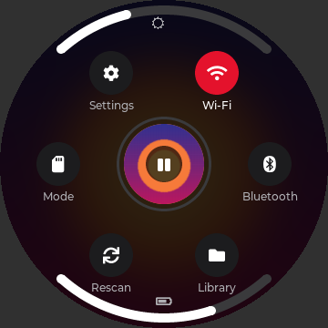 | 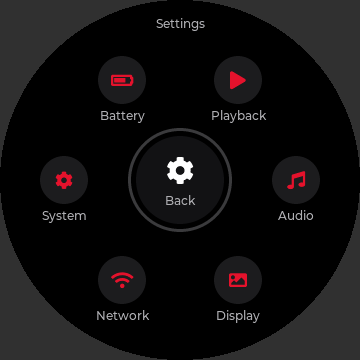 | 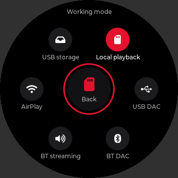 |

## Library & browsing
* **Curved lists** with position dots on the rim; smooth scrolling that stays fast with very large
  libraries (tested with 30,000 songs, 3,000-entry folders and playlists).
* **Long-press a song** (Library): Add to queue, Playlist, Favourite, Album, Artist, Info, Tags.
* **Folder browser** in the same style; long-press a song for queue actions + Rename, Copy/Move, Delete,
  or a folder for queue/playlist/tags + file operations (the playing track is protected; deletes confirm).
* **Search** with a big-key keyboard.

| Artists | Album | Hold a song | Folders | Hold a folder | Search |
|---|---|---|---|---|---|
| 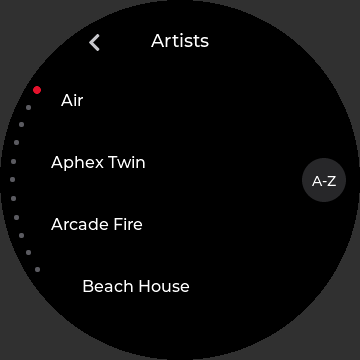 | 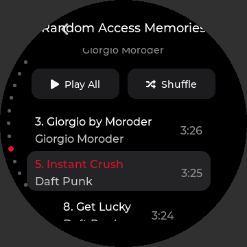 | 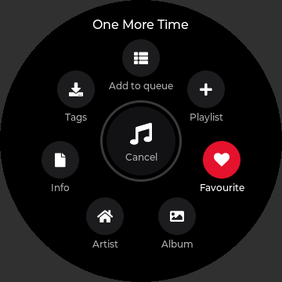 | 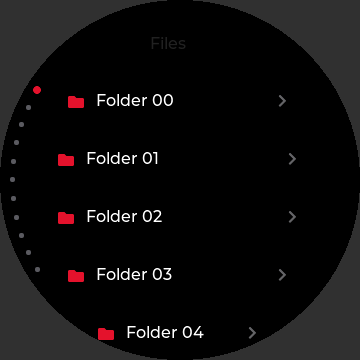 | 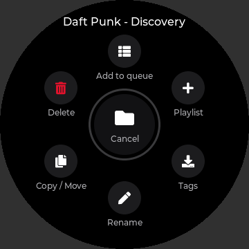 | 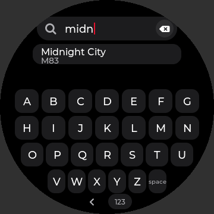 |

## Queue (up next)
Enqueued songs play **after the current song** (or after the last enqueued one), in order — Shuffle and
Repeat paused — then playback **returns to what you were playing**, in your play mode. Next goes straight to
the first queued song; Previous is left alone. The Queue screen shows what's playing, what's next and where
playback returns; tap a song to jump to it, drag to reorder, Shuffle or Clear. It survives a restart, and
file renames/moves/deletes keep it (and all playlists) up to date.

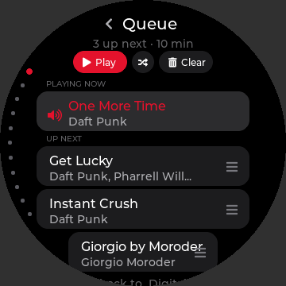

## Playlists
Curved rows with song counts; "Add to playlist" picker in the same style.

| Playlists | Add to playlist |
|---|---|
| 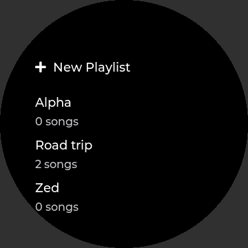 | 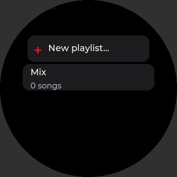 |

## Equalizer
Ten bands as "pizza slices": ±6 dB in 0.1 dB steps, **movable band frequencies** (a parametric-lite EQ,
Q fixed), −/+ buttons, a number pad, double-tap a band to reset it; built-in presets shown read-only.

| Gain | Frequency | Number pad | Built-in |
|---|---|---|---|
| 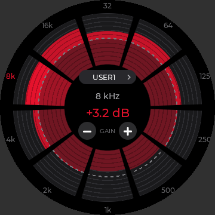 | 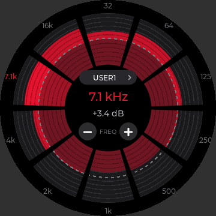 | 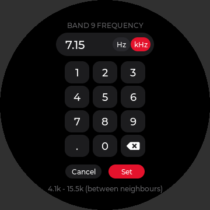 | 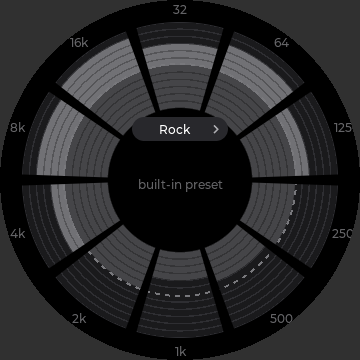 |

## Lyrics & artwork tagging
From any song/album/folder menu, or automatically (**Auto-tag**): fetches synced lyrics (lrclib) and a
600 px cover (iTunes) and writes them into the file's own tags (FLAC and MP3), only where missing.

## More screens
| Song Info (bitrate) | Battery & usage | Weather | Apps | Accent colour |
|---|---|---|---|---|
| 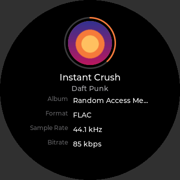 | 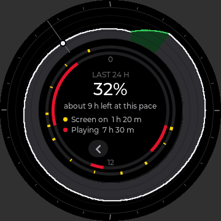 | 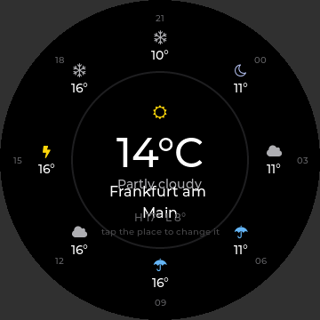 | 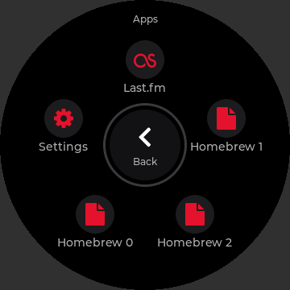 | 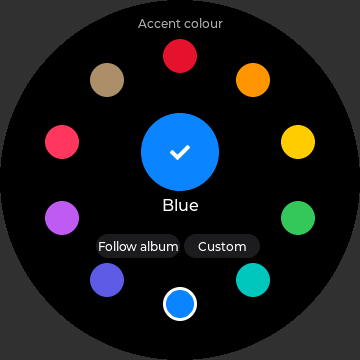 |

| Audiobooks | Chapters | Wi-Fi | Bluetooth | Toast + rescan |
|---|---|---|---|---|
| 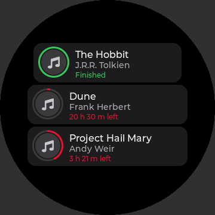 | 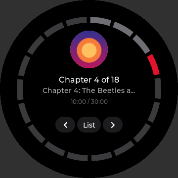 | 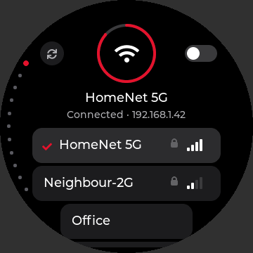 | 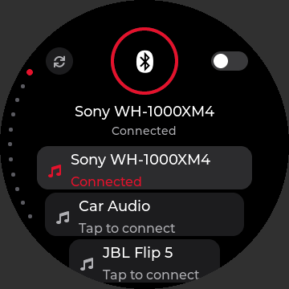 | 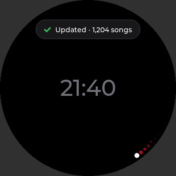 |

* **Battery & usage:** a 24-hour dial of battery level with screen-on and playing rings, 7 days of history.
* **Weather:** the next 24 hours around the rim (wttr.in, fetched only while open).
* **Audiobooks:** progress rings, time left; **Chapters:** a ring of segments, tap to jump.
* **Wi-Fi / Bluetooth:** a status ring (off / turning on / connected) and curved lists.
* **Library rescan:** a small dot orbits the rim while scanning; a toast when done.
* **Auto power-off** after idle time.

## Reliability & performance
* SD-card safety: a periodic filesystem flush so the card's metadata can't be lost on a hard power-off.
* Stability fixes (a use-after-free in long lists, bounds checks in the FLAC/JSON parsers), bounded
  Wi-Fi/Bluetooth commands so a hung service can't freeze the UI, work kept off the UI thread.
* Checked with AddressSanitizer/UBSan and cppcheck; render tests for each screen.

See [CHANGES.md](CHANGES.md) for the detailed change log.
